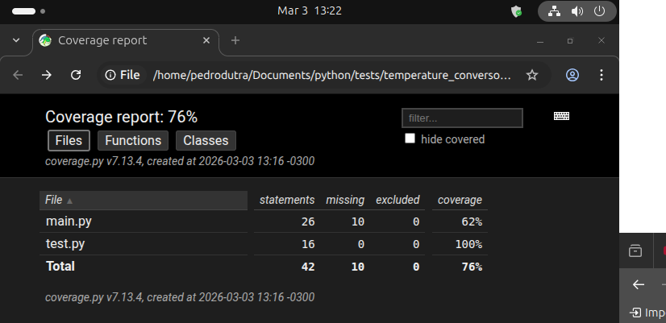
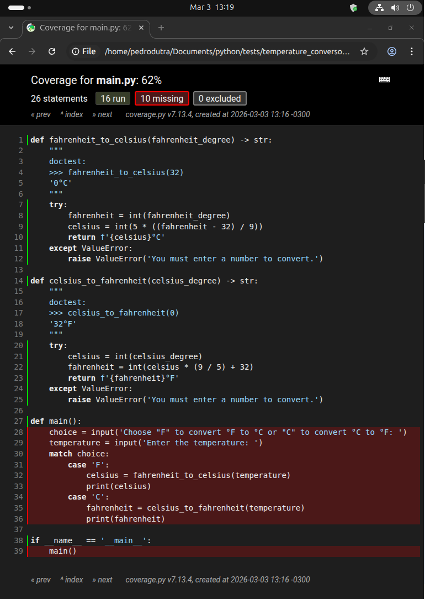

# Tests

## Summary

1. [How Does a Program Work?](#how-does-a-program-work)
2. [After all, What are Tests?](#after-all-what-are-tests)
3. [Isolating Things.](#isolating-things)
4. [The Framework.](#the-framework)
5. [Pytest.](#pytest)
6. [Testing With Pytest.](#testing-with-pytest)
7. [Mark.](#mark)
8. [Fixtures](#fixtures)


## How Does a Program Work?

Regardless of the type of existing program, it usually consists of having a data input, processing that data and giving exit, no matter if it is a web application, a system running via CLI, a data pipeline, etc. So we can assume that everything a program does is:
$$
\text{input} \rightarrow \text{processing} \rightarrow \text{output}
$$
To understand what these tests are in fact, we will take on an exercise given in the Python Brazil wiki, which basically consists of:

> Write a program that asks for the temperature in degrees Fahrenheit, converts it, and displays the temperature in degrees Celsius
>
> Below you will find the formula to do this.
> $$
> °C = 5 * ((°F - 32) / 9)
> $$


### Input

Thinking about the structure we discussed, our program will need to have an input (someone will enter a temperature in degrees Fahrenheit), there will be processing (this is where we will actually apply the necessary logic to process the data provided in the input and apply the formula shown above), and there will also be an output (in this case, it will be the temperature in degrees Celsius).

So, thinking in Python terms, our input will be done using the `input` function, and we will store the provided value in a variable called `fahrenheit`.

```python
fahrenheit = input('Enter the temperature in degrees Fahrenheit: ')
```


### Processing

We now need to work on the processing part. We will use the formula as a basis and create a function for it, called `fahrenheit_to_celsius`. It will receive the temperature in Fahrenheit as a parameter, perform the calculation, and return the temperature converted to Celsius.

```python
def fahrenheit_to_celsius(fahrenheit_degree) -> str:
    try:
        fahrenheit = int(fahrenheit_degree)
        celsius = int(5 * ((fahrenheit - 32) / 9))
        return f'{celsius} °C'
    except ValueError:
        raise ValueError('You must enter a number to convert.')
```

If it seems complex at first glance, I will explain this function to you. Basically, we receive an argument and we will return a string (which is what is described in the function signature). In the first block (`try / except`), we try to ensure that what is passed as an argument to the function is actually a number. It will attempt to convert it to an int (since values coming from the `input` function are always strings). If it cannot, we raise a `TypeError` informing the user that they must enter a number into the program to be converted.

Then, we create the variable `celsius`, where we actually apply the formula. We use the `int` function to convert.

Finally, we return a string containing the `celsius` variable along with the symbol `°C`, which indicates that the temperature is in degrees Celsius.


### Output

We are still missing the program's output. We need to display the result of the temperature processing so that the user can actually know what that temperature entered in Fahrenheit represents in Celsius. And this is very simple: we just need to store the result of the `fahrenheit_to_celsius` function, passing the `fahrenheit` variable, into a new variable called `celsius`, and then display it with a simple `print`.

```python
def fahrenheit_to_celsius(fahrenheit_degree) -> str:
    try:
        fahrenheit = int(fahrenheit_degree)
        celsius = int(5 * ((fahrenheit - 32) / 9))
        return f'{celsius} °C'
    except ValueError:
        raise ValueError('You must enter a number to convert.')
    

fahrenheit = input('Enter the temperature in degrees Fahrenheit: ')

celsius = fahrenheit_to_celsius(fahrenheit)

print(celsius)
```


## After all, What are Tests?

With a basic understanding of math, you can see that `32°F` equals `0°C`, because we take the temperature in °F and subtract 32, which gives 0, then divide by 9, which is still 0, and multiply by 5, which is still 0. So, a known case is that $32 °F = 0 °C$.

If you run the program and enter 32, it will confirm with the output:

```bash
Enter the temperature in degrees Fahrenheit: 32
```

The output will be:

```bash
0°C
```

Did you notice what you just did? That was a test! We discovered a correct result of what the program is supposed to do, provided the same input, and got the same output; the program worked!

Tests are nothing more than a guarantee that your application works.

Everyone runs tests all the time. We need to make sure that our function, which is supposed to return, for example, a temperature, doesn't return something like 'potatoes'. We are programmers, and we automate so many things, why not automate our tests too?


## Isolating Things

What can we do so that this code can be tested without our interference?

The first thing would be to isolate, but we need to know what to isolate, not everything needs to be tested. If we look at our input and output, we will see that we only use things provided by Python, like `input` and `print`, and those are already tested by the language (at least I hope they are). So what do we actually need to test?

The good news is that we have already isolated the entire processing part of our code in the `fahrenheit_to_celsius` function, which is exactly what we need to test!

In addition to isolating the function we want, we also need to isolate the execution context with the **main guard**, because when we create a test file, we don't want the input and output functions to run. The main reason we are doing automated tests is to remove the responsibility of providing input and checking output manually.

```python
def fahrenheit_to_celsius(fahrenheit_degree) -> str:
    try:
        fahrenheit = int(fahrenheit_degree)
        celsius = int(5 * ((fahrenheit - 32) / 9))
        return f'{celsius}°C'
    except ValueError:
        raise ValueError('You must enter a number to convert.')

def main():
    fahrenheit = input('Enter the temperature in degrees Fahrenheit: ')
    celsius = fahrenheit_to_celsius(fahrenheit)
    print(celsius)
        
if __name__ == '__main__':
    main()
```

In this way, when we import the main file into another file, it will not execute the functions contained within the `main` function.


### The Taxonomy of Tests

A test is composed of what we call triple A (AAA): Arrange, Act, Assert.

- **Arrange** is where we think about the input data.
- **Act** is when we execute the isolated code with the arranged input.
- **Assert** is when we state that the output must actually be what we expect.


### A Test Plan

Basically, we must know what the correct output of a test should be when it succeeds (because if we don't know the correct answer, how can we ensure that the test really passed?). And we already know that 32°F is 0°C, so I want to assert that when we pass 32 to our function, it should return 0°C.

And how can we do that?

One first approach would be what is called a `DocTest`. With a syntax very similar to Python's interactive mode, you write your test in a `docstring` and then call Python's `doctest` module, passing your file, like this:

```python
def fahrenheit_to_celsius(fahrenheit_degree) -> str:
    """
    doctest:
    >>> fahrenheit_to_celsius(32)
    0°C
    """
    try:
        fahrenheit = int(fahrenheit_degree)
        celsius = int(5 * ((fahrenheit - 32) / 9))
        return f'{celsius}°C'
    except ValueError:
        raise ValueError('You must enter a number to convert.')

def main():
    fahrenheit = input('Enter the temperature in degrees Fahrenheit: ')
    celsius = fahrenheit_to_celsius(fahrenheit)
    print(celsius)
        
if __name__ == '__main__':
    main()
```

If you run:

```bash
python -m doctest main.py
```

You will see that the test ran... and gave an ERROR?

If you have followed all the steps up to this exact moment, your terminal output was something like this:

```bash
**********************************************************************
File "/home/pedrodutra/Documents/python/tests/temperature_conversor/main.py", line 4, in main.fahrenheit_to_celsius
Failed example:
    fahrenheit_to_celsius(32)
Expected:
    0°C
Got:
    '0°C'
**********************************************************************
1 items had failures:
   1 of   1 in main.fahrenheit_to_celsius
***Test Failed*** 1 failures.
```

If you stop to read the error, you will see that what caused this problem: we set the expected output to be 0°C, but in reality it was a string `'0°C'`. And believe me, I did this on purpose. Let's fix it, and you will understand why this little mischief was done.

```python
def fahrenheit_to_celsius(fahrenheit_degree) -> str:
    """
    doctest:
    >>> fahrenheit_to_celsius(32)
    '0°C'
    """
    try:
        fahrenheit = int(fahrenheit_degree)
        celsius = int(5 * ((fahrenheit - 32) / 9))
        return f'{celsius}°C'
    except ValueError:
        raise ValueError('You must enter a number to convert.')

def main():
    fahrenheit = input('Enter the temperature in degrees Fahrenheit: ')
    celsius = fahrenheit_to_celsius(fahrenheit)
    print(celsius)
        
if __name__ == '__main__':
    main()
```

Now, if you run the command to execute the `doctest` module again, you will see that there is no output in the terminal. This means that our tests passed, our function returned exactly what we wanted.

A little anticlimactic, isn't it?


## The Framework

Python has a built-in testing library called `unittest`, so let's take a look at it.

Taking advantage of the fact that we isolated our function, let's create a new file called `test.py`. In it, we will import two things: first, the `TestCase` class from `unittest`, and second, our `fahrenheit_to_celsius` function from `main`.

```python
from unittest import TestCase

from main import fahrenheit_to_celsius
```

Now, we will create a class to test our function. We will call it `TestFahrenheitToCelsius`, and it will inherit from `TestCase`.

```python
from unittest import TestCase

from main import fahrenheit_to_celsius


class TestFahrenheitToCelsius(TestCase):
    ...
```

By convention, always name everything related to tests with `test` at the beginning of the name, for example, our first test case, where we will actually test our function by passing the number 32 as an argument.

```python
from unittest import TestCase

from main import fahrenheit_to_celsius


class TestFahrenheitToCelsius(TestCase):
    def test_should_return_0_when_receiving_32(self):
        assert fahrenheit_to_celsius(32) == '0°C'
```

The `assert` keyword in Python is responsible for comparing the value returned by the function with the expected value to check whether they are equal.

Now, we can run our test, and the command will be very similar to the one we used to run the `doctest`:

```bash
python -m unittest test.py
```

If you followed all the steps correctly, you will probably see a terminal output similar to this:

```bash
.
----------------------------------------------------------------------
Ran 1 test in 0.000s

OK
```

The `.` at the beginning means a successful test. We can confirm this by making an incorrect assertion to see how the failure is reported:

```python
from unittest import TestCase

from main import fahrenheit_to_celsius


class TestFahrenheitToCelsius(TestCase):
    def test_should_return_0_when_receiving_32(self):
        assert fahrenheit_to_celsius(32) == '0°C'
       
   	def test_should_return_1_when_receiving_0(self):
        assert fahrenheit_to_celsius(0) == '1°C'
```

Your terminal output will look something like this:

```bash
.F
======================================================================
FAIL: test_should_return_1_when_receiving_0 (test.TestFahrenheitToCelsius.test_should_return_1_when_receiving_0)
----------------------------------------------------------------------
Traceback (most recent call last):
  File "/home/pedrodutra/Documents/python/tests/temperature_conversor/test.py", line 10, in test_should_return_1_when_receiving_0
    assert fahrenheit_to_celsius(0) == '1°C'
           ^^^^^^^^^^^^^^^^^^^^^^^^^^^^^^^^^
AssertionError

----------------------------------------------------------------------
Ran 2 tests in 0.003s

FAILED (failures=1)
```

Great! Now we know that a test passed (`.`) and a test failed (`F`), but there's still one thing missing... If it failed, what should the conversion of 0°F actually be?

Since we inherit from `TestCase`, the correct approach is to use its built-in methods to make comparisons in a more robust way. The `TestCase` class provides dozens of assertions methods that handle different scenarios, so you don't have to rely on plain `assert`. Feel free to explore them, but here we'll cover a few key ones:

```python
from unittest import TestCase

from main import fahrenheit_to_celsius


class TestFahrenheitToCelsius(TestCase):
    def test_should_return_0_when_receiving_32(self):
        self.assertEqual(fahrenheit_to_celsius(32), '0°C')
       
   	def test_should_return_1_when_receiving_0(self):
        self.assertEqual(fahrenheit_to_celsius(0), '1°C')
```

And then your terminal output will be:

```bash
.F
======================================================================
FAIL: test_should_return_1_when_receiving_0 (test.TestFahrenheitToCelsius.test_should_return_1_when_receiving_0)
----------------------------------------------------------------------
Traceback (most recent call last):
  File "/home/pedrodutra/Documents/python/tests/temperature_conversor/test.py", line 10, in test_should_return_1_when_receiving_0
    self.assertEqual(fahrenheit_to_celsius(0), '1°C')
AssertionError: '-17°C' != '1°C'
- -17°C
? - -
+ 1°C


----------------------------------------------------------------------
Ran 2 tests in 0.001s

FAILED (failures=1)
```

Now we can see that `0°F` is `-17°C`, but let's get to know a new assertion method.

For this, we can use the negation of what we were already doing:

```python
from unittest import TestCase

from main import fahrenheit_to_celsius


class TestFahrenheitToCelsius(TestCase):
    def test_should_return_0_when_receiving_32(self):
        self.assertEqual(fahrenheit_to_celsius(32), '0°C')
       
   	def test_should_not_return_1_when_receiving_0(self):
        self.assertNotEqual(fahrenheit_to_celsius(0), '1°C')
```

And then, all our tests will pass.


### Making It a Little More Complex

Our initial problem was converting °F to °C, but now we're also going to convert °C to °F.

> The formula for this is:
> $$
> °F = °C * (9 / 5) + 32
> $$

```python
def fahrenheit_to_celsius(fahrenheit_degree) -> str:
    """
    doctest:
    >>> fahrenheit_to_celsius(32)
    '0°C'
    """
    try:
        fahrenheit = int(fahrenheit_degree)
        celsius = int(5 * ((fahrenheit - 32) / 9))
        return f'{celsius}°C'
    except ValueError:
        raise ValueError('You must enter a number to convert.')
    
def celsius_to_fahrenheit(celsius_degree) -> str:
    """
    doctest:
    >>> celsius_to_fahrenheit(0)
    '32°F'
    """
    try:
        celsius = int(celsius_degree)
        fahrenheit = int(celsius * (9 / 5) + 32)
        return f'{fahrenheit}°F'
    except ValueError:
        raise ValueError('You must enter a number to convert.')

def main():
    choice = input('Choose "F" to convert °F to °C or "C" to convert °C to °F: ')
    temperature = input('Enter the temperature: ')
    match choice:
        case 'F':            
            celsius = fahrenheit_to_celsius(temperature)
            print(celsius)
        case 'C':
            fahrenheit = celsius_to_fahrenheit(temperature)
            print(fahrenheit)
        
if __name__ == '__main__':
    main()
```

Now let's test it! 

If 32°F is equal 0 °C, then 0 °C should equal 32 °F. Returning to our `test.py` file:

```python
from unittest import TestCase

from main import fahrenheit_to_celsius, celsius_to_fahrenheit

class TestFahrenheitToCelsius(TestCase):
    def test_should_return_0_when_receiving_32(self):
        self.assertEqual(fahrenheit_to_celsius(32), '0°C')

    def test_should_not_return_1_when_receiving_0(self):
        self.assertNotEqual(fahrenheit_to_celsius(0), '1°C')

class TestCelsiusToFahrenheit(TestCase):
    def test_should_return_32_when_receiving_0(self):
        self.assertEqual(celsius_to_fahrenheit(0), '32°F')

    def test_should_not_return_0_when_receiving_1(self):
        self.assertNotEqual(celsius_to_fahrenheit(1), '0°F')
```

So far, we've followed the happy path, but how can we ensure that our application will fail when it receives incorrect input?

```python
from unittest import TestCase

from main import fahrenheit_to_celsius, celsius_to_fahrenheit

class TestFahrenheitToCelsius(TestCase):
    def test_should_return_0_when_receiving_32(self):
        self.assertEqual(fahrenheit_to_celsius(32), '0°C')

    def test_should_not_return_1_when_receiving_0(self):
        self.assertNotEqual(fahrenheit_to_celsius(0), '1°C')

    def test_should_return_valueerror_when_receiving_strings(self):
        self.assertRaises(ValueError, fahrenheit_to_celsius, 'a')

class TestCelsiusToFahrenheit(TestCase):
    def test_should_return_32_when_receiving_0(self):
        self.assertEqual(celsius_to_fahrenheit(0), '32°F')

    def test_should_not_return_0_when_receiving_1(self):
        self.assertNotEqual(celsius_to_fahrenheit(1), '0°F')

    def test_should_return_valueerror_when_receiving_strings(self):
        self.assertRaises(ValueError, celsius_to_fahrenheit, 'a')
```


### Exploring Test Coverage

Okay, we've built the application and tested it, and we're sure it works, but how do we know **what exactly was tested?**

We can use test coverage to see exactly what parts of our code were tested, in a visual and intuitive way. Let's take a look now.

To do this, we'll need to install a library called `coverage` (I know you'll create a virtual environment for this), so after creating and activate the virtual environment, run:

```bash
pip install coverage
```

With the package installed, let's now run the sequence of commands to rerun the tests and generate the coverage report.

1. `python -m coverage run -m unittest test.py`.

   - This command will run the tests again and generate a file called `.coverage`.

2. `coverage report`.

   - This command will show you how much of your code was covered by tests.

   - ```bash
     Name      Stmts   Miss  Cover
     -----------------------------
     main.py      26     10    62%
     test.py      16      0   100%
     -----------------------------
     TOTAL        42     10    76%
     ```

3. `coverage html`.
   - This command will actually create the HTML report based on the information provided in the previous commands. A folder named `htmlcov` will be created in your project root, open the `index.html` file inside it to see the test coverage results.

When you open the file, you will see the files we are working on and, next to them, the coverage percentage for each file.



By clicking on the `main.py` file, you will see that everything not tested in the program consists of features provided by the language itself.




## Pytest

Pytest is a Python testing framework. A more 'Pythonic' alternative to `unittest`, it is:

- Simple;
- Scalable;
- Rich in Plugins;
- Supports pypy;
- First released in 2009;
- Currently at version 9.0.2.

Before continuing, I would like to explain that I changed the project to use Poetry, which is the tool I use in my daily work. If you prefer to continue with the conventional environment, that's fine, but I will explain what I did to introduce Poetry and the tools I use.

The first thing I did was delete the `venv` folder, then run `poetry init -n` to create the `pyproject.toml`.

Next, we add the libraries and frameworks we're going to use: coverage, pytest, and taskipy. We add them as follows:

```bash
poetry add --group dev coverage pytest taskipy
```

Next, we will configure taskipy in the `pyproject.toml`.

```toml
[tool.taskipy.tasks]
test = 'python -m coverage run -m pytest test.py -vv'
post_test = 'coverage html'
```

This way, we don't need to run that huge test command or generate the coverage separately. A single command will execute both, and that command is the following:

- If you have the shell activated in your Poetry environment:

  - ```bash
    poetry shell
    task test
    ```

- If you don't have the shell activated in Poetry:

  - ```bash
    poetry run task test
    ```

One nice thing is that pytest can run the tests we created for unittest, and we can already see how pytest displays the tests in the terminal:

```bash
==================== test session starts ====================
platform linux -- Python 3.14.3, pytest-9.0.2, pluggy-1.6.0
rootdir: /home/pedrodutra/Documents/python/tests
configfile: pyproject.toml
collected 6 items                                           

test.py ......                                        [100%]

===================== 6 passed in 0.02s =====================
Wrote HTML report to htmlcov/index.html
```


## Testing With Pytest

Okay, we’ve already managed to run our tests that were written for unittest in pytest, but how can we write tests specifically for pytest? The truth is that pytest will try to detect everything that starts with "test". By following this convention when naming classes, it reads them correctly, and that’s all we need. This way, we can simplify the tests, making them look like this:

```python
from main import fahrenheit_to_celsius, celsius_to_fahrenheit


# Fahrenheit to Celsius
def test_should_return_0_when_receiving_32():
    assert fahrenheit_to_celsius(32) == '0°C'

def test_should_not_return_1_when_receiving_0():
    assert fahrenheit_to_celsius(0) != '1°C'


# Celsius to Fahrenheit
def test_should_return_32_when_receiving_0():
    assert celsius_to_fahrenheit(0) == '32°F'

def test_should_not_return_0_when_receiving_1():
    assert celsius_to_fahrenheit(1) != '0°F'
```

Notice that we removed the error assertion; it’s a bit more complex and would require a context manager. We’ll come back to it later.

If you have a good memory, you'll recall that at the beginning we talked about 3 steps test, or basically `AAA`. So let's take this opportunity to discuss where each part fits, because right now our tests are basically wrapped into a single line starting with `assert`. This is what is called in [Kent Beck](https://en-wikipedia-org.translate.goog/wiki/Kent_Beck?_x_tr_sl=en&_x_tr_tl=pt&_x_tr_hl=pt&_x_tr_pto=tc)'s book a One-Step Test.

Basically, we have the three elements inside a single line. Taking our last test as an example, we can see that:

- `celsius_to_fahrenheit(1)` can be considered the Arrange part.
- `celsius_to_fahrenheit(1) != '0°F'` would be the Act part.
- And the full expression `assert celsius_to_fahrenheit(1) != '0°F'` would be the Assert.

In computer science theory, the function `celsius_to_fahrenheit()` would be called the SUT (System Under Test).

We've seen quite a lot so far, but there's still something that bothers me. There are two comments in the test code that don't really add any value, they only make it easier to identify where each test is.

What if we could create some kind of marker so that, if we wanted to run tests separetely, we could do so, removing those comments and adding something actually functional instead?


## Mark

The marking feature can help us create "tags" our "groups" for specific tests. We can simplify commands or run tests for specific cases.

```python
from pytest import mark

from main import fahrenheit_to_celsius, celsius_to_fahrenheit


@mark.f2c
def test_should_return_0_when_receiving_32():
    assert fahrenheit_to_celsius(32) == '0°C'

@mark.f2c
def test_should_not_return_1_when_receiving_0():
    assert fahrenheit_to_celsius(0) != '1°C'

@mark.c2f
def test_should_return_32_when_receiving_0():
    assert celsius_to_fahrenheit(0) == '32°F'

@mark.c2f
def test_should_not_return_0_when_receiving_1():
    assert celsius_to_fahrenheit(1) != '0°F'
```

You can see that I replaced the comments. Now we import `mark` from pytest and, before each test, we specify which group it belongs to. This way, when we run the execution command, only the chosen group will be tested. Shall we see this in action?

```bash
task test -m f2c
```

And then the terminal will return something huge...

```bash
==================== test session starts ====================
platform linux -- Python 3.14.3, pytest-9.0.2, pluggy-1.6.0
rootdir: /home/pedrodutra/Documents/python/tests
configfile: pyproject.toml
collected 4 items / 2 deselected / 2 selected               

test.py ..                                            [100%]

===================== warnings summary ======================
test.py:6
  /home/pedrodutra/Documents/python/tests/test.py:6: PytestUnknownMarkWarning: Unknown pytest.mark.f2c - is this a typo?  You can register custom marks to avoid this warning - for details, see https://docs.pytest.org/en/stable/how-to/mark.html
    @mark.f2c

test.py:10
  /home/pedrodutra/Documents/python/tests/test.py:10: PytestUnknownMarkWarning: Unknown pytest.mark.f2c - is this a typo?  You can register custom marks to avoid this warning - for details, see https://docs.pytest.org/en/stable/how-to/mark.html
    @mark.f2c

test.py:14
  /home/pedrodutra/Documents/python/tests/test.py:14: PytestUnknownMarkWarning: Unknown pytest.mark.c2f - is this a typo?  You can register custom marks to avoid this warning - for details, see https://docs.pytest.org/en/stable/how-to/mark.html
    @mark.c2f

test.py:18
  /home/pedrodutra/Documents/python/tests/test.py:18: PytestUnknownMarkWarning: Unknown pytest.mark.c2f - is this a typo?  You can register custom marks to avoid this warning - for details, see https://docs.pytest.org/en/stable/how-to/mark.html
    @mark.c2f

-- Docs: https://docs.pytest.org/en/stable/how-to/capture-warnings.html
======== 2 passed, 2 deselected, 4 warnings in 0.02s ========
Wrote HTML report to htmlcov/index.html
```

Although intimidating, this message isn't really scary, it just tells us that our mark is not recognized. We need to document it in `pyproject.toml`.

```toml
[tool.pytest.ini_options]
markers = [
    'f2c: tests for Fahrenheit to Celsius conversion',
    'c2f: tests for Celsius to Fahrenheit conversion'
]
```

And then, if you run the same command again, the output will be:

```bash
==================== test session starts ====================
platform linux -- Python 3.14.3, pytest-9.0.2, pluggy-1.6.0
rootdir: /home/pedrodutra/Documents/python/tests
configfile: pyproject.toml
collected 4 items / 2 deselected / 2 selected               

test.py ..                                            [100%]

============== 2 passed, 2 deselected in 0.01s ==============
Wrote HTML report to htmlcov/index.html
```

We can see that two tests passed and two were not selected.

But well... if it said that our mark is not recognized, that means there **are recognized marks**. So, which ones are they?

- **@mark.skip:** skips a test.
- **@mark.skipif: **skips a test in a specific context.
- **@mark.xfail:** this test is expected to fail in some context. 
- **@mark.parametrize:** parametrizes tests.

We won't cover them all here. If you're curious, feel free to look them up on Google.

Do you remember the two tests we skipped? We can use these markers to handle them without a context manager for now:

```python
from pytest import mark

from main import fahrenheit_to_celsius, celsius_to_fahrenheit


@mark.f2c
def test_should_return_0_when_receiving_32():
    assert fahrenheit_to_celsius(32) == '0°C'

@mark.f2c
def test_should_not_return_1_when_receiving_0():
    assert fahrenheit_to_celsius(0) != '1°C'

@mark.f2c
@mark.xfail
def test_should_return_valueerror_when_receiving_a():
    assert fahrenheit_to_celsius('a') == '100°C'

@mark.c2f
def test_should_return_32_when_receiving_0():
    assert celsius_to_fahrenheit(0) == '32°F'

@mark.c2f
def test_should_not_return_0_when_receiving_1():
    assert celsius_to_fahrenheit(1) != '0°F'

@mark.c2f
@mark.xfail
def test_should_return_valueerror_when_receiving_b():
    assert celsius_to_fahrenheit('b') == '100°F'
```

And then our output will be like this:

```bash
==================== test session starts ====================
platform linux -- Python 3.14.3, pytest-9.0.2, pluggy-1.6.0
rootdir: /home/pedrodutra/Documents/python/tests
configfile: pyproject.toml
collected 6 items                                           

test.py ..x..x                                        [100%]

=============== 4 passed, 2 xfailed in 0.04s ================
Wrote HTML report to htmlcov/index.html
```

One thing we can notice is that our test file is getting huge just to test two functions. Shall we use `parametrize` to improve this?

```python
from pytest import mark

from main import fahrenheit_to_celsius, celsius_to_fahrenheit


@mark.f2c
@mark.parametrize(
    'fahrenheit, celsius',
    [(32, '0°C'), (-40, '-40°C')]
)
def test_fahrenheit_to_celsius(fahrenheit, celsius):
    assert fahrenheit_to_celsius(fahrenheit) == celsius

@mark.c2f
@mark.parametrize(
    'celsius, fahrenheit',
    [(0, '32°F'), (-40, '-40°F')]
)
def test_celsius_to_fahrenheit(celsius, fahrenheit):
    assert celsius_to_fahrenheit(celsius) == fahrenheit

@mark.xfail
@mark.parametrize(
    'fahrenheit, celsius',
    [('a', '28°C'), ('81°F', 'b')]
)
def test_should_return_valueerror_when_receiving_a_string(fahrenheit, celsius):
    assert fahrenheit_to_celsius(fahrenheit) == celsius
    assert celsius_to_fahrenheit(celsius) == fahrenheit
```

This way, we can test multiple scenarios without having to create a function for each scenario.
